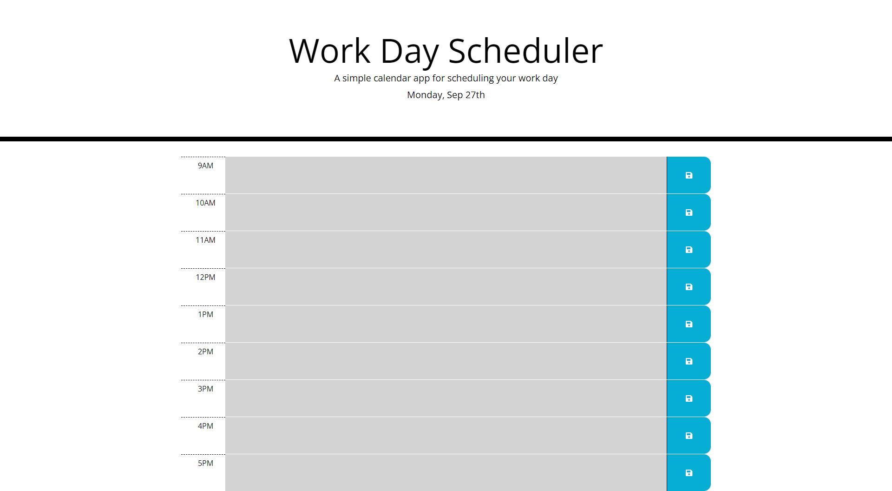

# Work Day Scheduler 

## Purpose
A schedule for the average workshift timings that allows the user to list things that may need to be done by a certain time. It can then be saved and persist even if the browser has been closed. The hour blocks will constantly update to either show gray: past, red:current hour/due soon, green:future. The top of the page will always display the current month and day.

## Project Details
This project was to practice and demonstrate the understanding and usage of JavaScript libraries, third party API's, and localStorage.

## Built With
* HTML
* CSS
* JavaScript
* Moment.js
* JQuery

## Website
https://ahmed-sajjad111.github.io/workday-scheduler/

## Preview

## Contribution
Made by [Ahmed Sajjad]